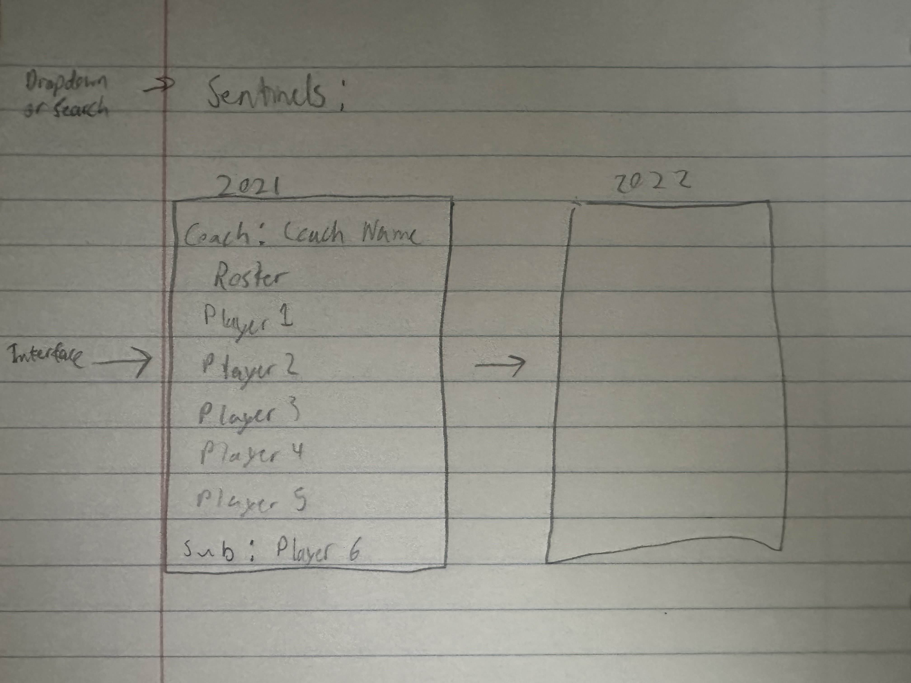

Goals:

1. Analyze team data from the Valorant Esports Tier 1 scene to determine predictors of success in international events
2. Identify trends in player performance and integration with teammates to identify "cores" (players and/or coaches that perform better together) that amplify performance and drive success.
3. Be able to select teams over time to see a web/graph of the player they have playing
4. Be able to select individual players and see their teams/teammates over time


Steps:

* [ ] Scrape liquipedia/vlr and acquire data about players/coaches (rosters) over all franchised/prefranchising events that are S-tier/Riot Official events (Tier 1)
* [ ] Construct a visualizer and UI that allows you to select a team and visualize roster developments over seasons.
* [ ] Also be able to select players visualize their team changes over seasons

Alpha Goals (MVP): 
* [x] Create a data organization system for scraped data
* [ ] Create a UI that allows users to select a team from a drop down (with searching abilities) (USE REACT or use some sort of dashboard tool like tableau or power bi)
* [ ] Display rosters per team as shown below




SQL Schema:
* [ ] Events: (pkey, event name, date, tier)
* [ ] Organizations: (pkey, org name, activeSince, …),
* [ ] Players: (pkey, player name, age, organization),
* [ ] Roster: (pkey, Event key, Organization key, placement),
* [ ] RosterMembers (weak entity): (roster pkey, players pkey)

ChatGPT based SQL Schema (looks like i did pretty well + bold is primary key):
* [ ] Events: (**pkey**, event name, date, tier)
* [ ] Organizations: (**pkey**, org name, …),
* [ ] Players: (**pkey**, player name, age, organization),
* [ ] EventOrgs: (**pkey** ,Event key, Organization key, placement),
* [ ] EventOrgPlayers (weak entity): (**EventOrgs pkey, players pkey**)


Setup:

Set up a virtual environment in VSCode

Run this in the ValorantAnalyticEngine directory to install the required python packages
```
pip install -r requirements.txt
```


plotly python or plotly js
react material ui