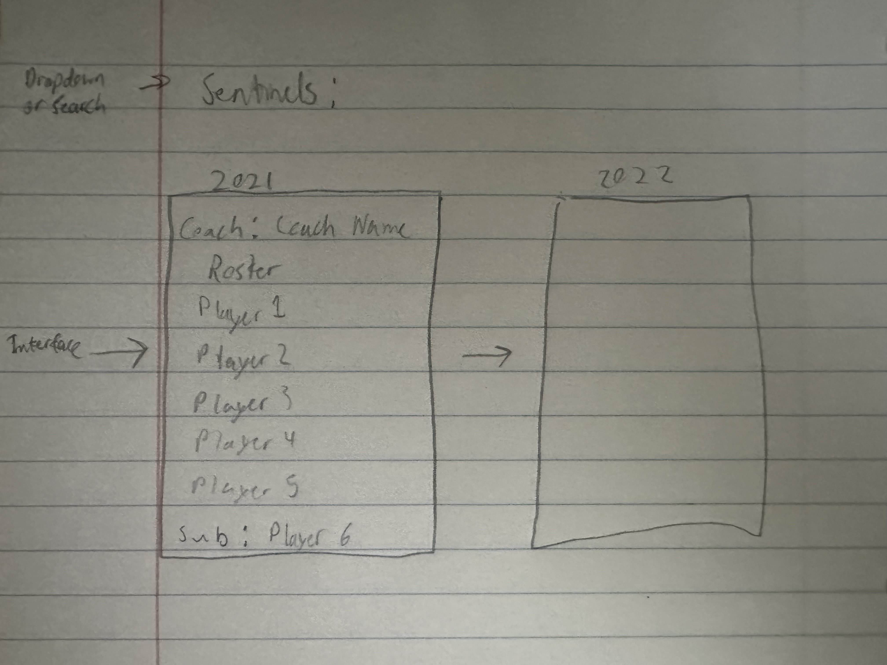

Getting Started:

1. Set up a virtual environment in VSCode

Run this in the ValorantAnalyticEngine directory to install the required python packages
```
pip install -r requirements.txt
```

2. Set up a .env file to connect to a PostgreSQL database

Create a .env file in the ValorantAnalysisEngine directory with the below variables, filling out the variables 
```
DB_NAME=
DB_USER=
DB_PASSWORD=
DB_HOST=
DB_PORT=
```

3. Run project_run.py in the ValorantAnalysisEngine working directory 


Goals:

1. Analyze team data from the Valorant Esports Tier 1 scene to determine predictors of success in international events
2. Identify trends in player performance and integration with teammates to identify "cores" (players and/or coaches that perform better together) that amplify performance and drive success.
3. Be able to select teams over time to see a web/graph of the player they have playing
4. Be able to select individual players and see their teams/teammates over time


Steps:

* [ ] Scrape liquipedia/vlr and acquire data about players/coaches (rosters) over all franchised/prefranchising events that are S-tier/Riot Official events (Tier 1)
* [ ] Construct a visualizer and UI that allows you to select a team and visualize roster developments over seasons.
* [ ] Also be able to select players visualize their team changes over seasons

Alpha Goals (MVP): 
* [x] Create a data organization system for scraped data
* [ ] Create a UI that allows users to select a team from a drop down (with searching abilities) (USE REACT or use some sort of dashboard tool like tableau or power bi)
* [ ] Display rosters per team as shown below



# 📘 Database Schema Overview

This database schema models **Valorant esports events**, **organizations**, and **players**, with full tracking of event participation, placements, and earnings.

---

## 🏆 Events

| Column | Type | Description |
|:-------|:-----|:-------------|
| `event_id` | `SERIAL PRIMARY KEY` | Unique identifier for each event |
| `event_name` | `TEXT NOT NULL` | Name of the event |
| `event_start_date` | `DATE NOT NULL` | Start date of the event |
| `end_date` | `DATE NOT NULL` | End date of the event |
| `participants` | `INT NOT NULL` | Number of teams participating |
| `prize_pool` | `INT` | Total prize pool amount (optional) |
| `event_link` | `TEXT` | URL to the event’s website or Liquipedia page |
| **Unique Constraint** | `(event_name, participants)` | Prevents duplicate events with same name and participant count |

---

## 🏢 Organizations

| Column | Type | Description |
|:-------|:-----|:-------------|
| `org_id` | `SERIAL PRIMARY KEY` | Unique identifier for each organization |
| `org_name` | `TEXT NOT NULL` | Name of the organization/team |
| `org_region` | `TEXT NOT NULL` | Region the organization is based in |
| `org_link` | `TEXT NOT NULL` | URL to the organization’s Liquipedia or official page |
| **Unique Constraint** | `(org_link, org_region)` | Ensures each org’s link is unique within its region |

---

## 🧑‍💻 Players

| Column | Type | Description |
|:-------|:-----|:-------------|
| `player_id` | `SERIAL PRIMARY KEY` | Unique identifier for each player |
| `player_name` | `TEXT NOT NULL` | Player’s in-game or display name |
| `player_link` | `TEXT NOT NULL UNIQUE` | URL to player’s Liquipedia or profile page |

---

## ⚙️ EventOrgs

Links **organizations** to the **events** they participate in, along with placement and earnings information.

| Column | Type | Description |
|:-------|:-----|:-------------|
| `event_org_id` | `SERIAL PRIMARY KEY` | Unique record linking an org to a specific event |
| `event_id` | `INT NOT NULL` → `Events(event_id)` | Reference to the event |
| `org_id` | `INT NOT NULL` → `Organizations(org_id)` | Reference to the organization |
| `placement_start` | `INT` | Starting placement (e.g., 1 for winner, 5 for top 5–8) |
| `placement_end` | `INT` | Ending placement (used for placement ranges) |
| `winnings` | `INT` | Total prize money earned by this org at this event |
| `vct_points` | `INT` | Valorant Champions Tour (VCT) points earned |
| **Unique Constraint** | `(event_id, org_id)` | Ensures one record per org per event |

---

## 👥 EventOrgPlayers

Links **players** to their **organization’s participation in an event**, allowing flexible rosters per event.

| Column | Type | Description |
|:-------|:-----|:-------------|
| `event_org_id` | `INT NOT NULL` → `EventOrgs(event_org_id)` | Reference to the org-event pairing |
| `player_id` | `INT NOT NULL` → `Players(player_id)` | Reference to the player |
| **Primary Key** | `(event_org_id, player_id)` | Composite key ensuring unique pairing |

---

## 🧩 Entity Relationships

```text
Events (1) ───< (many) EventOrgs (many) >─── Organizations
                      │
                      ▼
                  EventOrgPlayers (many) >─── Players


<!-- SQL Schema:
* [ ] Events: (pkey, event name, date, tier)
* [ ] Organizations: (pkey, org name, activeSince, …),
* [ ] Players: (pkey, player name, age, organization),
* [ ] Roster: (pkey, Event key, Organization key, placement),
* [ ] RosterMembers (weak entity): (roster pkey, players pkey)

ChatGPT based SQL Schema (looks like i did pretty well + bold is primary key):
* [ ] Events: (**pkey**, event name, date, tier)
* [ ] Organizations: (**pkey**, org name, …),
* [ ] Players: (**pkey**, player name, age, organization),
* [ ] EventOrgs: (**pkey** ,Event key, Organization key, placement),
* [ ] EventOrgPlayers (weak entity): (**EventOrgs pkey, players pkey**) -->


plotly python or plotly js
react material ui


Current Issues:
* [x] Scraping of VCT points appears to be inaccurate occasionally (possibly due to table columns being different [FIXED], due to multiple vct points in one row for different teams [FIXED])
* [x] Scraping of Team names and url appears to not work sometimes (because of country flags [FIXED])
* [x] some old team cards appear to have coach on same tab as players, just appearing below them (possibly solved, going to need to check larger json files [FIXED])